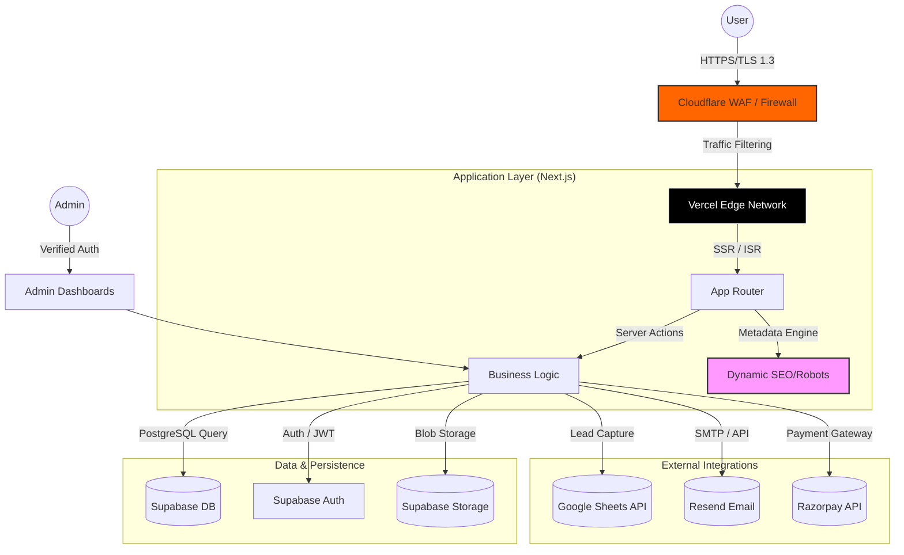
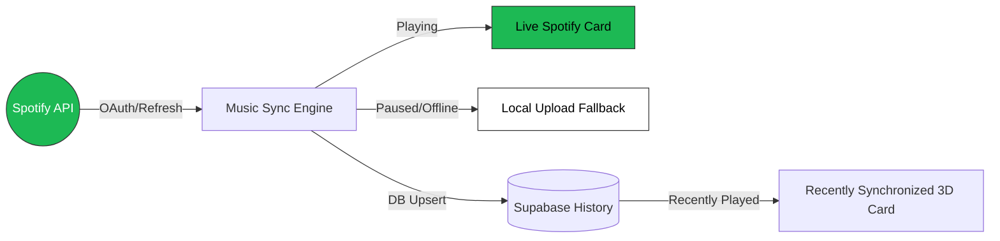

# avrxt | Full-Stack Infrastructure & Personal Engine


A high-performance, premium personal website and service platform built with **Next.js 15+**, **Supabase**, **Tailwind CSS 4**, and **Vercel Analytics**. Designed for speed, security, scalability, and absolute control.

---

## 🏗️ System Architecture



---

## 🚀 Key Features

### 🎯 Core Pages & Functionality
- **Landing Page (`/`)**: High-impact hero section with glassmorphism, tech stack matrices, and production metrics.
- **Profile Node (`/me`)**: Immersive "Link in Bio" ecosystem with **Real-Time Spotify Synchronization**, 3D recently played cards, and newsletter terminal.
- **Technical Library (`/docs`)**: Markdown-powered documentation system with professional SEO and admin controls.
- **Interaction Hub (`/guestbook`)**: Verified community messaging system via GitHub OAuth.
- **Project Intake (`/hireme`)**: Advanced budget/timeline estimator for service inquiries.

### 🎵 Music Synchronization Engine
- **Live_Spotify Protocol**: Real-time polling of Spotify playback status with dynamic progress bars.
- **Intelligent Dual-Buffer**: Automatic transition between Live Spotify and local Uploaded Music frequency when offline.
- **Recently_Synchronized 3D Cards**: Historical playback memory with "Last Seen" timestamps and immersive 3D hover interactions.
- **Visual Flow Bars**: Premium CSS-animated gradient flow on all music progress indicators.



### ☁️ Cloud Engineering (`/cloud`)
Premium tier-based service architecture for:
- **Discord Bot Development**: Moderation, AI Dashboards, and Custom Neural Architectures.
- **Website Re-Design**: UI/UX overhauls and performance refactoring.
- **Infrastructure Maintenance**: 24/7 monitoring and security hardening.

### 🔐 Security & Privacy (Harden Layer)
- **Zero-Index Protocol**: Admin endpoints and sensitive success routes are hardcoded with `robots: { index: false }` and disallowed via `robots.ts`.
- **Infrastructure Hardening**: Enforced TLS 1.3, CSP headers, and Cloudflare WAF protection.
- **Data Governance**: Full compliance with **DPDP Act 2023** and **GDPR**.
- **Secure Payments**: 256-bit SSL encrypted Razorpay integration with automated non-refundability notices.

### 📈 Pro-Level SEO
- **Dynamic Sitemap**: Automatically generated `sitemap.ts` that crawls base routes and dynamic Cloud services.
- **Metadata Objects**: Server-side metadata injection for high-fidelity social sharing and search ranking.
- **Dynamic Robots**: Programmatic `robots.ts` to manage search engine crawl budget efficiently.

---

## 🛠️ Technology Stack

| Layer | Technologies |
|--- |--- |
| **Frontend** | Next.js 15+, React 19, Tailwind CSS 4, Lucide |
| **Backend** | Next.js Server Actions, Node.js |
| **Database** | Supabase (PostgreSQL), Realtime |
| **Auth** | Supabase Auth, GitHub OAuth |
| **Communications** | Resend API, Google Sheets API |
| **Payments** | Razorpay SDK |
| **Observability** | Vercel Analytics, Vercel Speed Insights |

---

## 🏗️ Project Structure

```bash
src/
├── app/
│   ├── (legal)/         # Privacy, Terms, Refund, Security pages
│   ├── actions/        # Secured Server Actions (Cloud, Cupcake, Docs)
│   ├── admin/          # Multi-node admin dashboards
│   ├── cloud/          # Cloud services & payment infrastructure
│   ├── me/             # Personalized profile & bio terminal
│   ├── robots.ts       # Dynamic Robots configuration
│   └── sitemap.ts      # Dynamic Sitemap generator
├── components/         # Premium UI Components (Reveal, Spotlight, etc.)
├── lib/               # Shared logic & Supabase client
└── utils/             # Helper functions & constants
```

---

## ⚙️ Setup & Deployment

1. **Clone & Install**:
   ```bash
   git clone https://github.com/avrxtcloud/avrxt-in.git
   npm install
   ```

2. **Environment**: Configure `.env.local` with Supabase, Resend, Razorpay, and Google Service Account credentials.

3. **Deploy**: Optimized for Vercel with automatic CI/CD on `main` and `development` branches.

---

## 🎨 Design Philosophy
The system follows a **"Dark Mesh"** design language:
- **Performance**: Sub-second LCP (Largest Contentful Paint).
- **Aesthetics**: Glassmorphism, blurred backdrop filters, and typography-driven layouts.
- **Responsiveness**: Fluid scaling from 320px to 4K displays.

---

## 📝 License & Contact
**PROPRIETARY & CONFIDENTIAL**  
Copyright © 2026 **@avrxt**. All rights reserved.

This project is strictly for the exclusive use of **@avrxt**. Unauthorized copying, modification, distribution, or any form of reproduction of this project (source code, design, or architecture) without express written permission is a violation of international intellectual property laws.

⚠️ **LEGAL NOTICE**: Any unauthorized usage or duplication of this project will lead to immediate **legal action**.

**Developer**: [@avrxt](https://instagram.com/aviorxt) | [support@avrxt.in](mailto:support@avrxt.in)

*Last Updated: February 25, 2026*
